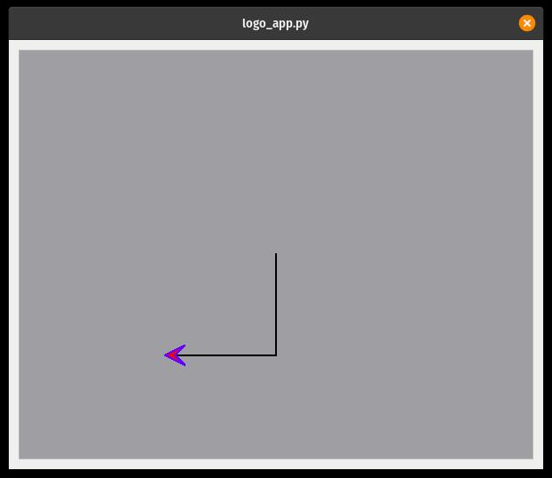
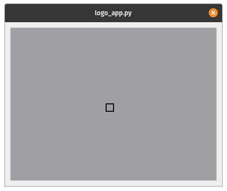

# TKOM - Język zbliżony do logo z elementami obiektowymi

**Paweł Kotiuk 292898**
## Opis projektu

Stworzenie własnego interpretera języka koncepcyjnie zbliżonego do Logo, lecz z mechanizmami obiektowymi w kontekście żółwia. Ma on pozwalać min na tworzenie wielu instancji żółwia na ekranie.  
Język Logo znany w Polsce także jako Logomocja. Jest on prostym językiem programowania skierowanym głównie do uczniów szkół. Pozwala on w sposób wizualny zapoznać się uczniom z programowaniem. W tym wypadku aspekt ten realizowany poprzez pozwolenie użytkownikowi na sterowanie kursorem (żółwiem) rysującym po planszy za pomocą odpowiednich komend.

## Funkcjonalności

Cechy samego języka:

- Lokalność zmiennych
- Typy wbudowane
  - num - liczba
  - string - ciąg znaków
  - turtle - jest to obiekt reprezentujący wskaźnik (w domyśle żółw), którym kierować może użytkownik
  - bool - typ logiczny
  - funkcja - przechowywanie wskazania na już instniejącą funkcję do zmiennej
- dynamiczne typowanie zmiennych
- Wykonywanie wyrażeń arytmetycznych działający zgodnie z ogólnie przyjętą dot. konwencją kolejności operatorów.
- Wykonywanie wyrażeń logicznych działający zgodnie z ogólnie przyjętą dot. konwencją kolejności operatorów.
- Możliwe istnienie wielu instancji żółwia jednocześnie
- Definiowanie własnych funkcji oraz ich późniejsze używanie
- Możliwość tworzenia pętli `while`
- Instrukcje warunkowe `if`
- Obsługa niektórych sytuacji wyjątkowych (np. dzielenie przez 0)
- Funkcja print wypisująca informacje

Pozostałe wymagania dotyczące funkcjonalności:

- wbudowany obiekt żółwia
- stworzenie GUI wizualizującego ruchy oraz linie rysowane przez żółwia.


## Użycie

Program jest opakowany w prostą aplikację terminalową pozwalającą na wybranie pliku, który ma zostać wykonany oraz umożliwiający opcjonalne wyświetlenie wyników rysowania.

```bash
./logo_app.py -h
usage: logo_app.py [-h] [-n] file

Simple logo-like language interpreter

positional arguments:
  file             path to file with code

optional arguments:
  -h, --help       show this help message and exit
  -n, --no-render  Don't show turtle visualization after execution
```

W ramach testów warto uruchomić przykładowy program w głównym folderze.

```bash
./logo_app.py ./testfile.logo
```

### Składania

#### Podstawy

**Definiowanie zmiennych** polega na przypisaniu zmiennej jakiejś wartości, nie wymaga się uprzedniej deklaracji.

```cpp
numer = 321
prawda = True
falsz = False
slowo = "Slowo"
```

**Funkcje** są definiowane za pomocą słowa kluczowego `fun`.  
`fun NAZWA_FUNKCJI ( NAZWY_ARGUMENTÓW_PODZIELONE_PRZECINKAMI ) { CIAŁO FUNKCJI }`

Język ma zaimplementowane funkcje wbudowane `print` oraz `println`.

Program:

```cpp
fun hello(imie)
{
  println("Witaj "+imie)
}

hello("Jan")
```

Zwróci: `Witaj Jan`

Do zwracania wartości z wnętrza funkcji należy użyć funkcni wbudowanej `return`.

```cpp
fun square(num)
{
  return(num*num)
}

square(4)
```

**Warunki**

```cpp
if(warunek)
{
  funkcja_gdy_prawda()
}else
{
  funkcja_gdy_falsz()
}
```

**Pętla while**

```cpp
while(WARUNEK)
{
 jakies_funkcje()
}
```

**Wbudowany typ żółwia** - wbudowany obiekt żółwia jest wykorzystywany do rysowania po płótnie.

Płótno jest powierzchnią o wymiarach 200 na 200, gdzie punkt o położeniu 0,0 jest na środku.

Tworzy się go za pomocą konstruktora `Turtle()`.

Metody obsługiwane przez żółwia:

- `get_x()`
- `get_y()`
- `get_angle()`
- `fd(distance)` - przemieść żółwia o x jednostek do przodu
- `rotate(ang)` - obróć żółwia zgodnie z ruchem wskazówek zegara o `ang` stopni
- `set_angle(ang)` - ustaw kąt żółwia na wartość `ang`
- `set_x(x)`
- `set_y(y)`

Warto pamiętać, że jeśli żółw zostanie zmiszczony (np był stworzony tylko wewnątrz funkcji, lub nadpisujemy go czymś innym) to wyrenderuje się nam tylko jego ścieżka

Program:

```cpp
t=Turtle()

t.fd(50)
t.rotate(90)
t.fd(50)
print("Obecne polozenie x: ")
print(t.get_x())
print(" y: ")
println(t.get_y())
```

Powinien zwrócić: `Obecne polozenie x: -50.0 y: 50.0`

oraz wyświetlić:



Osie `x` i `y` (pozioma i pionowa) rosną w kierunku prawym i dolnym.

**Operacje** - Do dyspozycji mamy standardowy zestaw operacji arytmetycznych oraz logicznych:  
`+  -  *  /  !  =  ||  &&  ==  !=  <  <=  >  >=`

```cpp
numer = 212
prawda = 22+43 < 12 || numer > 11

```

#### Dodatkowe przykłady

```cpp
fun fib(num)
{
  if(num<=1)
  {
    return(1)
  }
  return(fib(num-1)+fib(num-2))
}

print("Result of fib(10): ")
println(fib(10))                 
```

Ten kod pokazuje prostą funkcję rekurencyjną liczącą ciąg Fibonacciego z liczby 10.  
Wświetla on:  
`Result of fib(10): 89.0`

Przykładowy program rysujący kwadrat:

```cpp
fun draw_square(len)
{
  i = 0
  t = Turtle()
  while(i<=3)
  {
    t.fd(len)
    t.rotate(90)
    i=i+1
  }
  pole = len*len
  return(pole)
}

print("Obrysowane pole ")

pole=draw_square(10)

msg = ""

if(pole > 10 && pole <200)
{
  println("jest wieksze od 12 i mniejsze od 200")
}else
{
  println("jest inne niz przewidywane")
}

```

W konsoli powinno zostać wypisane `Obrysowane pole jest wieksze od 10 i mniejsze od 200`.

A na ekranie powinien zostać wyrenderowany obrazek:



Warto zwrócić uwagę na brak wskaźnika pokazującego położenie żółwia jest to spowodowane tym, że obiekt, który na niego wskazywał został zniszczony przy wyjściu z kontekstu funkcji rysującej.

## Realizacja

Projekt jest napisany w języku python  z wykorzystaniem biblioteki PyQt5 w celu wizualizacji generowanego obrazu.

### Gramatyka

**program**  =  `{ statement | definition };`  
**definition** = `functionDefinition;`  
**functionDefinition** =  `"fun" identifier, "(", [ identifier, {",", identifier} ], ")", block;`  
**statement** = ` ifStatement | whileStatement | expression | valueAssignment; `  
**ifStatement** = `"if", "(", logicalExpression, ")", block[ "else" block] ;`  
**whileStatement** = `"while", "(", logicalExpression, ")", block;`  
**block** = `"{", {statement}, "}" ;`  

**valueAssignment** = `identifier, "=", expression;`  
**expression** = `logicalExpression;`  
**logicalExpression** = `andCondition, {"||", andCondition};`  
**andCondition** = `relation, {"&&", relation};`  
**relation** = `mathExpression, [compSign, mathExpression]`;  
**mathExpression** = `AddExpression, { addSign, AddExpression};`  
**AddExpression** = `factor, {multSign, factor};`  
**factor** = `[ "!" | "-" ], (value | "(" logicalExpression ")");`  
**value** = `identifier, {functionOperator | fieldOperator } | constValue`  

**functionOperator** = `"(" [ expression, {",", expression} ], ")";`  
**fieldOperator** = `"." identifier`

**addSign** = `"+" | "-" ;`  
**multSign** = `"*" | "/";`  
**logicSign** = `"||" | "&&";`  
**compSign** = `"==" | "!=" | "<" | "<=" | ">" | ">=";`  

**identifier** = `letter, {naturalNumber | letter | specialSign};`  
**constValue** = `number | string;`  
**string** = `'"' {letter | naturalNumber | specialSign | stringEscapedSign} '"';`  
**number** = `naturalNumber [ ".", digit, {digit}];`  
**naturalNumber** = `"0" | (nonZeroDigit, {digit});`  

**letter** = `"A" | "B" | "C" | "D" | "E" | "F" | "G" | "H" | "I" | "J" | "K" | "L" | "M" | "N" | "O" | "P" | "Q" | "R" | "S" | "T" | "U" | "V" | "W" | "X" | "Y" | "Z" | "a" | "b" | "c" | "d" | "e" | "f" | "g" | "h" | "i" | "j" | "k" | "l" | "m" | "n" | "o" | "p" | "q" | "r" | "s" | "t" | "u" | "v" | "w" | "x" | "y" | "z" ;`  
**nonZeroDigit** = `"1" | "2" | "3" | "4" | "5" | "6" | "7" | "8" | "9" ;`  
**digit** = `"0" | nonZeroDigit;`  
**specialSign** = `"_";`  
**stringEscapedSign** = `'/"';`  

### Tokeny

Lista tokenów:

identifier - token zawierający identyfikator, który może wskazywać na jakąś zmienną, czy też funkcję  
constValue - token bezpośrednio przeliczany na jakąś wartość  
"fun", "if", "else", "while",  
"{", "}", "(", ")", '"'  
"+", "-", "*",  "/", "!"  "="  
"||", "&&", "==",  "!=", "<", "<=", ">", ">="  
EOF - End Of File

Funkcje wbudowane takie jak `print` nie są tokenami, podobnie jak nazwy typów wbudowanych, bedą one rozpoznawane jako identyfikatory.

### Testy

Testy poszczególnych elementów analizatora są realizowane za pomocą prostych testów jednostkowych stworzonych z pomocą narzędzia pytest.  

Uruchomienie testów:

```bash
pytest --pyargs mylang
```

Testy są podzielone na 3 główne części:

 - `test_lexer` - zbiór testów sprawdzających poprawność działania leksera
 - `test_parser` - testy powiązane z działalnością parser
 - `test_evaluation` - testy powiązane z wykonywaniem kodu programu

W każdej z grup testów weryfikowana jest zarówno poprawnośc wykonania oraz poprawne zwracanie różnego rodzaju wyjątków.

Testy były pisane na bieżąco, przy każdym znalezionym błędzie, który nie jest pokryty w ramach zbioru testowego dodawany był nowy testcase mający badać dany przypadek.
